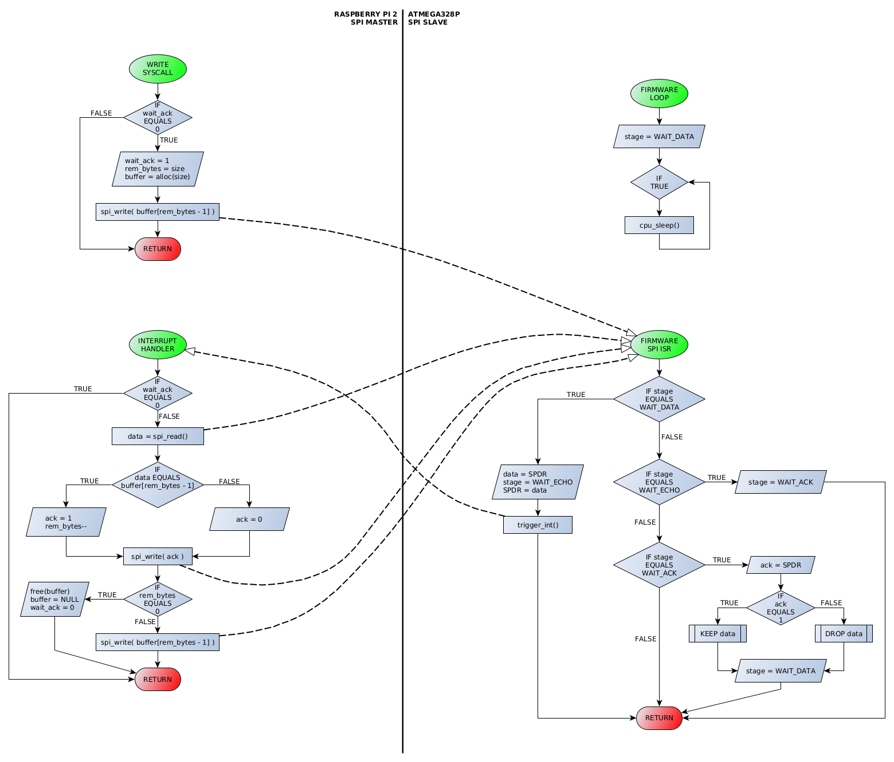

# Reliable SPI Communication between Raspberry Pi 2 and ATmega328P

Although there already exist solutions aimed at improving the reliability of SPI bus in complex environment, this simple project can anyway provides inspiration for designing different serial communication protocols, or at least a basic guide to setting up a minimal HW/SW environment that allows SPI communication between a Raspberry Pi 2 Model B and an ATmega328P-PU microcontroller.

## Introduction

This repository provides the implementation of a reliable SPI communication that relies on an acknowledgement-based protocol built on top of the SPI controller's driver that the Linux kernel already provides for the Broadcom BCM2836 SoC.

This repository is organized as follows:

* directory `src/linux/arch/arm/boot/dts/` contains the device-tree file
* directory `src/raspberry-pi-2/` maintains the sources of the kernel module
* directory `src/atmega328p/` maintains the sources of the firmware
* directory `src/test/` contains a test program

## Protocol

Loading the Linux kernel module, after having performed the configuration described in the next section, gives rise to the creation of a SPI device that probes by using the information contained in the device-tree file, plus the creation of a character device that user applications can open and write to in order to initiate a new transfer session. A write to the character device returns an error code if a previously initiated transfer is still active, otherwise it returns after having copied the buffer from user-space to kernel-space. The transfer session will then continue asincrounously by relying on a kernel thread devoted to handle interrupts coming from the SPI device, according to the protocol shown below.

<p align="center"></p>

The firmware flashed into the ATmega328P always begins working in a state called WAIT_DATA after every initializazion that occurs upon reset. Once all resources have been initialized, the firmware sets the sleep mode (IDLE mode allows the SPI and the interrupt system to continue operating while the CPU stops), enebales interrupts and goes to sleep. It will be awaken every time a serial transfer completes.

## Configuration

In figure below is reported the whole hardware configuration that encloses both the Raspberry Pi 2 and the ATmega328P. The Raspberry Pi 2 supplies 3.3V power to the ATmega328P.

<p align="center"></p>

### ATmega328P Configuration Detail

ATmega328P is a 28 pin high performance, low power 8-bit microcontroller based on AVR RISC architecture. It is the most popular of all AVR controllers as it is used in ARDUINO boards. It provides many features that are accessible through many pins, of which we are interested to those that give access to the SPI capabilities. These are:

* Pin 16 - **PB2** : **SS** - Chip Select (in)
* Pin 17 - **PB3** : **MOSI** - Master-Out Slave-In (in)
* Pin 18 - **PB4** : **MISO** - Master-In Slave-Out (out)
* Pin 19 - **PB5** : **SCK** - SPI Clock (in)

Additionally, a GPIO pin is used as a mean to deliver interrupts to the Raspberry Pi 2. This is:

* Pin 11 - **PD5** : **INT** - Interrupt (out)

Also, the Raspberry Pi 2 is in charge to reset the ATmega328P both when the driver is loaded, and when the protocol is broken down due to failures that may occur during some phases of the communication. This is possible by exploiting:

* Pin 1 - **PC6** : **RST** - Reset (in)

All pins listed above, whose direction has been configured as mentioned within brackets, allow to realize the basic HW configuration of the ATmega328P with the aim of making it a SPI slave that is capable of delivering interrupts when data is ready to be passed to the master.

<p align="center"></p>

As for the other pins, we remand the reader to this [link](https://github.com/emisilve86/Lighting-LEDs-ATmega328P) where a more detailed explaination is given by referring to the considerations provided by Atmel for a correct completion of the hardware configuration.

### Raspberry Pi 2 Configuration Detail

The Raspberry Pi 2 Model B is the second-generation Raspberry Pi equipped with an upgraded Broadcom
BCM2836 processor, which is a powerful ARM Cortex-A7 based quad-core processor. The Raspberry Pi supports various distributions of Linux and can be used for many of the things that a normal desktop PC does, including word-processing, spreadsheets, multimedia, games, and programming.

<p align="center"></p>

The Raspberry Pi 2 header is equipped with 40 pins that give access to many features, of which we are interested to:

* Pin 24 - **GPIO08** : **CE0** - Chip Select (out)
* Pin 21 - **GPIO09** : **MISO** - Master-In Slave-Out (in)
* Pin 19 - **GPIO10** : **MOSI** - Master-Out Slave-in (out)
* Pin 23 - **GPIO11** : **CLK** - SPI Clock (out)

Moreover, it must be able to reset the ATmega328P under particular circumstances. Thus, we configured a dedicated GPIO for this purpose:

* Pin 15 - **GPIO22** : **RST** - Reset (out)

The Raspberry Pi 2 must also be able to receive interrupts from the ATmega328P whenever data is ready to be transfered from slave to master. To this end we configured the following GPIO:

* Pin 16 - **GPIO23** : **INT** - Interrupt (in)

Also, the SPI interface must be enabled at the system level to make the first four pins work as expected, and the controller driver to be loaded as well. This can be achieved by updating the `/boot/config.txt`. Find and uncomment the relative line:

```
dtparam=spi=on
```

But first we need to give the system a description of the hardware configured as mentioned above. The system could not be able to determine how to configure pins at a lower level otherwise, nor it could be able to determine the compatibility of the SPI device with our driver. To do this, we alter the device-tree file `bcm2709-rpi-2-b.dts` to include a new device that we simply named `spimodule` as follow:

```
&spi0 {
	. . .
	spimodule: spimodule@0{
		compatible = "spimodule";
		reg = <0>;	// CE0
		#address-cells = <1>;
		#size-cells = <0>;
		spi-max-frequency = <100000>;

		interrupts = <23 IRQ_TYPE_EDGE_FALLING>; // GPIO 23 is INT
		interrupt-controller;
		#interrupt-cells = <2>;
		interrupt-parent = <&gpio>;

		reset-gpio = <&gpio 22 GPIO_ACTIVE_LOW>; // GPIO 22 is RESET
	};
	. . .
};
```

This file is available in the Linux kernel source tree for Raspberry Pi, which can be cloned from this [url](https://github.com/raspberrypi/linux), and it is located in `arch/arm/boot/dts`. It can be either compiled with `dtc`, or you can rely on the kernel's Makefile by following the guide presented at this [link](https://www.raspberrypi.com/documentation/computers/linux_kernel.html). Anyhow, the `dtb` file resulting from compilation must be copied in the `/boot/` directory where also the bootcode and kernel images reside.
